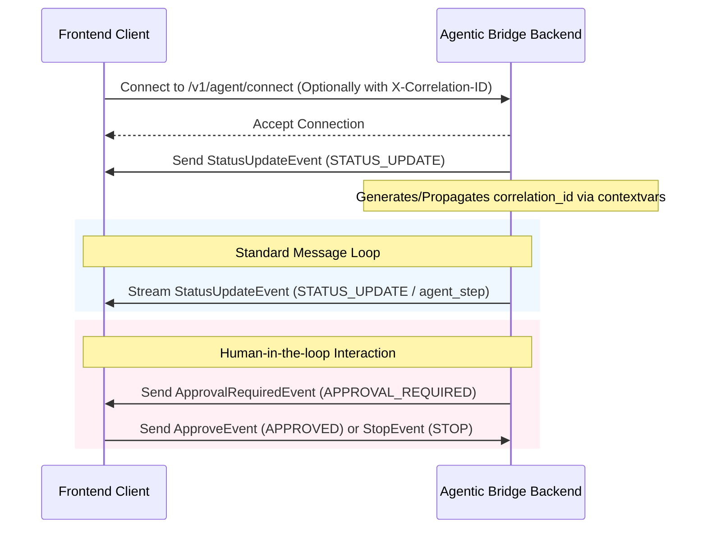

# Trybo Agentic Bridge - WebSocket Architecture

This document describes the design and contract of the real-time WebSocket communication layer between the frontend and the backend.

## Endpoint
- **URL**: `/v1/agent/connect`
- **Protocol**: WS / WSS (WebSocket)

---

## 1. Design & Communication Model

### Event-Driven Communication
The system utilizes a structured, bidirectional event-driven paradigm where:
1. **Outbound (Server-to-Client)**: The backend streams granular task states, agent logs, errors, and human-in-the-loop interactive requests.
2. **Inbound (Client-to-Server)**: The frontend sends control directives (e.g. Approve/Stop inputs) back to influence execution.

### Why WebSockets Instead of Polling?
- **Real-Time Responsiveness**: Agent execution steps (such as drafting outreach and analyzing vendor responses) need to stream instantly to the user interface.
- **Low Latency & Overhead**: Reusing a single TCP connection avoids the continuous overhead of repeatedly establishing HTTP handshakes required by polling.
- **Bi-directional Stream**: Simplifies the orchestration flow where the backend can request approval and receive a client response on the exact same channel without coordinate polling status checks.

---

## 2. Request Tracing & Correlation

To maintain clear async-safe execution traces, every connection is associated with a `correlation_id`:
- During connection, the server checks the client's handshake headers for `X-Correlation-ID`.
- If missing, the server generates a new `UUID4` correlation ID.
- This ID is propagated using Python `contextvars` for all operations in the active WebSocket session, injecting it automatically into all centralized log statements.

---

## 3. Communication Flow



---

## 4. Sample Payloads

All WebSocket event payloads derive from `BaseWebSocketEvent` containing the trace context (`event_type`, `correlation_id`, and `task_id`).

### Outbound Events (Server-to-Client)

#### Initial Connection / Status Update
```json
{
  "event_type": "STATUS_UPDATE",
  "correlation_id": "9b1deb4d-3b7d-4bad-9bdd-2b0d7b3dcb6d",
  "task_id": null,
  "task_state": "RUNNING",
  "agent_step": "SEARCHING_VENDORS",
  "message": "WebSocket connection established successfully"
}
```

#### Approval Required
```json
{
  "event_type": "APPROVAL_REQUIRED",
  "correlation_id": "9b1deb4d-3b7d-4bad-9bdd-2b0d7b3dcb6d",
  "task_id": "task-abc-123",
  "task_state": "WAITING_APPROVAL",
  "draft_message": "Draft email message to vendor...",
  "message": "Outreach email draft generated. Awaiting approval."
}
```

#### Task Completed
```json
{
  "event_type": "TASK_COMPLETED",
  "correlation_id": "9b1deb4d-3b7d-4bad-9bdd-2b0d7b3dcb6d",
  "task_id": "task-abc-123",
  "task_state": "SUCCESS",
  "message": "Task successfully executed. Outreach finalized."
}
```

### Inbound Events (Client-to-Server)

#### Approve
```json
{
  "event_type": "APPROVED",
  "correlation_id": "9b1deb4d-3b7d-4bad-9bdd-2b0d7b3dcb6d",
  "task_id": "task-abc-123"
}
```

#### Stop
```json
{
  "event_type": "STOP",
  "correlation_id": "9b1deb4d-3b7d-4bad-9bdd-2b0d7b3dcb6d",
  "task_id": "task-abc-123"
}
```
