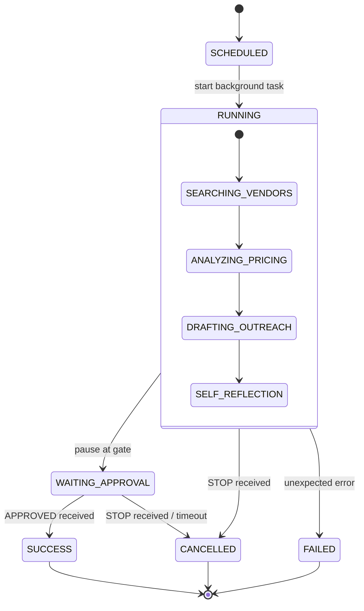
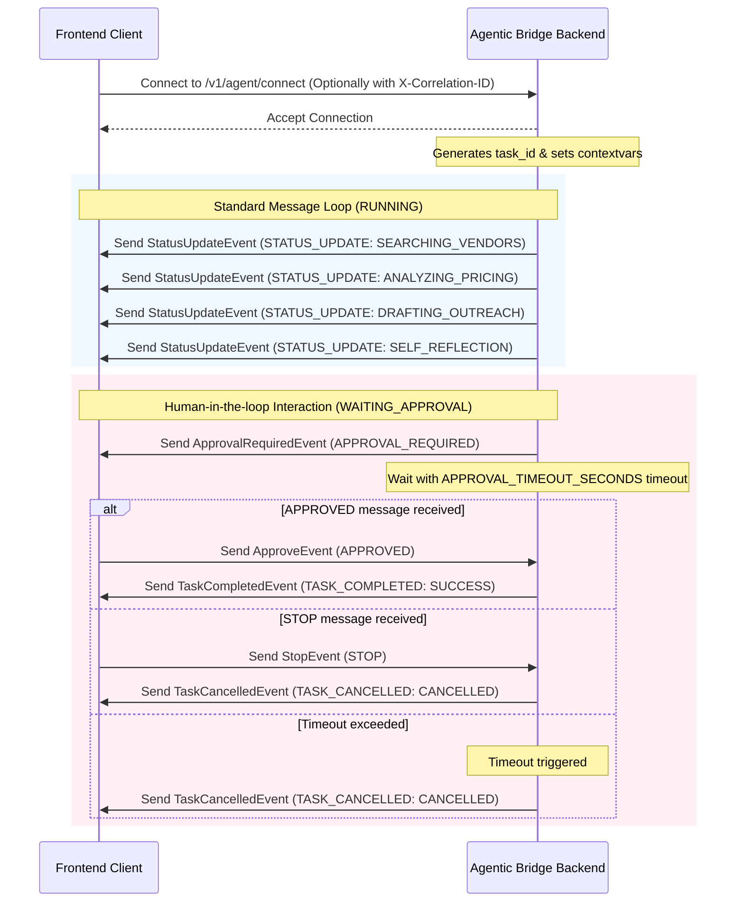

# Trybo Agentic Bridge - WebSocket Architecture

This document describes the design and contract of the real-time WebSocket communication layer between the frontend and the backend.

## Endpoint
- **URL**: `/v1/agent/connect`
- **Protocol**: WS / WSS (WebSocket)

---

## 1. Design & Communication Model

### Event-Driven Communication
The system utilizes a structured, bidirectional event-driven paradigm where:
1. **Outbound (Server-to-Client)**: The backend streams granular task states, agent logs, errors, and human-in-the-loop interactive requests.
2. **Inbound (Client-to-Server)**: The frontend sends control directives (e.g. Approve/Stop inputs) back to influence execution.

### Why WebSockets Instead of Polling?
- **Real-Time Responsiveness**: Agent execution steps (such as drafting outreach and analyzing vendor responses) need to stream instantly to the user interface.
- **Low Latency & Overhead**: Reusing a single TCP connection avoids the continuous overhead of repeatedly establishing HTTP handshakes required by polling.
- **Bi-directional Stream**: Simplifies the orchestration flow where the backend can request approval and receive a client response on the exact same channel without coordinating polling status checks.

---

## 2. Request Tracing & Correlation

To maintain clear async-safe execution traces, every connection is associated with a `correlation_id` and a `task_id`:
- During connection, the server checks the client's handshake headers for `X-Correlation-ID`.
- If missing, the server generates a new `UUID4` correlation ID.
- The server also generates a unique `UUID4` `task_id` for the session.
- These IDs are propagated using Python `contextvars` for all operations in the active WebSocket session and are automatically injected into all centralized log statements.
- Context tokens are captured upon propagation and reset in `finally` blocks in both the connection handler and background tasks to prevent context leakage across asynchronous tasks.

---

## 3. Communication Flow & State Machine





---

## 4. Orchestration & Coordination Strategies

### Active Task Registry
To coordinate async execution without databases or persistent message brokers, the backend maintains an in-memory dictionary registry `active_tasks` mapping `task_id -> task_metadata`:
```python
active_tasks[task_id] = {
    "websocket": websocket,
    "task": asyncio_task_reference,
    "approval_event": asyncio.Event(),
    "task_state": TaskState,
    "cancelled": bool
}
```
This is cleaned up immediately upon completion, cancellation, or connection drops to prevent memory leaks.

### Human-in-the-Loop Approval Gate
The orchestration workflow uses Python's `asyncio.Event` (`approval_event`) to pause workflow execution:
- When entering `WAITING_APPROVAL` state, the orchestrator calls `await approval_event.wait()`.
- If an `APPROVED` payload arrives in the websocket loop, `approval_event.set()` is called, resuming execution.

### Approval Timeout Strategy
To prevent hanging tasks, the orchestrator wraps approval waiting in `asyncio.wait_for(...)` using a configurable timeout defined by the `APPROVAL_TIMEOUT_SECONDS` environment variable (default: `10` seconds):
- If no response is received in this window, `asyncio.TimeoutError` is raised.
- The backend catches it, logs it at `WARNING` level, transitions task state to `CANCELLED`, issues a `TaskCancelledEvent` to the client, and cleans up task resources.

### STOP Interruption Flow
If a `STOP` event is received (or a client disconnect is caught), the orchestrator triggers immediate task interruption:
- Marks the task state as `CANCELLED` and `cancelled = True`.
- Invokes `.cancel()` on the task's `asyncio.Task` reference.
- This raises `asyncio.CancelledError` inside the background runner coroutine, allowing the task to gracefully perform final event emission and connection cleanup without orphan routines.
- Checks `websocket.client_state == WebSocketState.CONNECTED` to avoid sending to a closed websocket.

---

## 5. Sample Payloads

All WebSocket event payloads derive from `BaseWebSocketEvent` containing the trace context (`event_type`, `correlation_id`, and `task_id`).

### Outbound Events (Server-to-Client)

#### Status Update
```json
{
  "event_type": "STATUS_UPDATE",
  "correlation_id": "9b1deb4d-3b7d-4bad-9bdd-2b0d7b3dcb6d",
  "task_id": "8fa16de3-d144-482d-83b9-a29bc0192d29",
  "task_state": "RUNNING",
  "agent_step": "SEARCHING_VENDORS",
  "message": "Searching for vendors..."
}
```

#### Approval Required
```json
{
  "event_type": "APPROVAL_REQUIRED",
  "correlation_id": "9b1deb4d-3b7d-4bad-9bdd-2b0d7b3dcb6d",
  "task_id": "8fa16de3-d144-482d-83b9-a29bc0192d29",
  "task_state": "WAITING_APPROVAL",
  "draft_message": "Hello vendor, we would like to discuss pricing...",
  "message": "Draft generated. Awaiting user approval."
}
```

#### Task Completed
```json
{
  "event_type": "TASK_COMPLETED",
  "correlation_id": "9b1deb4d-3b7d-4bad-9bdd-2b0d7b3dcb6d",
  "task_id": "8fa16de3-d144-482d-83b9-a29bc0192d29",
  "task_state": "SUCCESS",
  "message": "Task successfully executed. Outreach finalized."
}
```

#### Task Cancelled
```json
{
  "event_type": "TASK_CANCELLED",
  "correlation_id": "9b1deb4d-3b7d-4bad-9bdd-2b0d7b3dcb6d",
  "task_id": "8fa16de3-d144-482d-83b9-a29bc0192d29",
  "task_state": "CANCELLED",
  "message": "Orchestration cancelled by client."
}
```

### Inbound Events (Client-to-Server)

#### Approve
```json
{
  "event_type": "APPROVED",
  "correlation_id": "9b1deb4d-3b7d-4bad-9bdd-2b0d7b3dcb6d",
  "task_id": "8fa16de3-d144-482d-83b9-a29bc0192d29"
}
```

#### Stop
```json
{
  "event_type": "STOP",
  "correlation_id": "9b1deb4d-3b7d-4bad-9bdd-2b0d7b3dcb6d",
  "task_id": "8fa16de3-d144-482d-83b9-a29bc0192d29"
}
```
