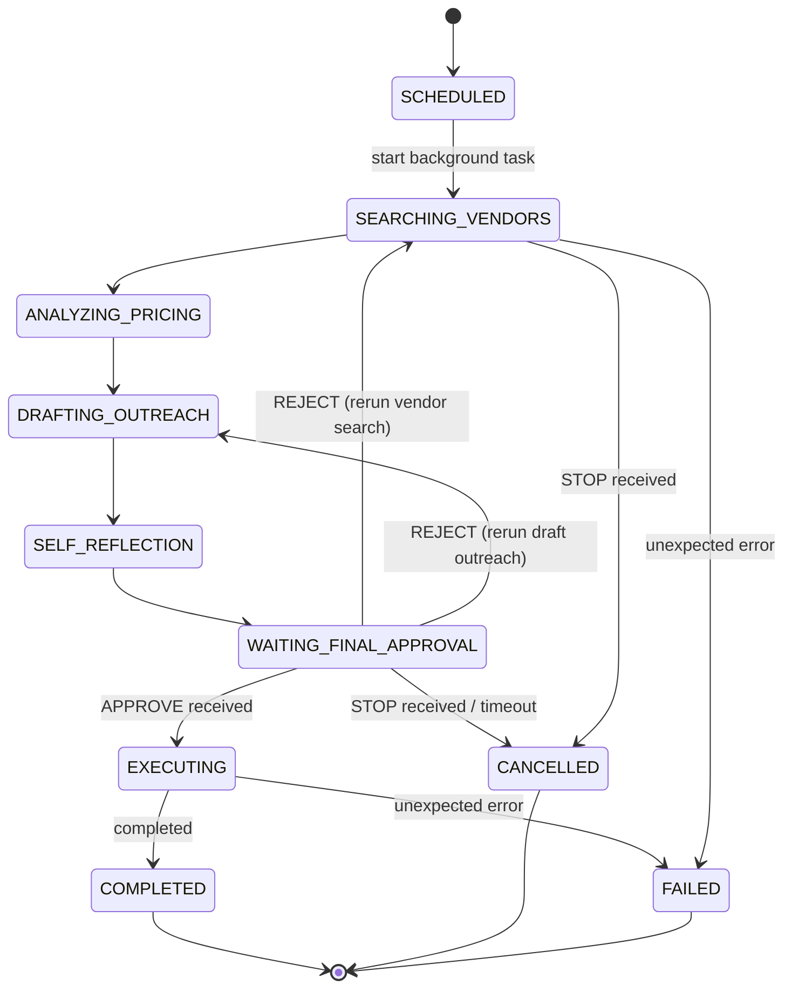
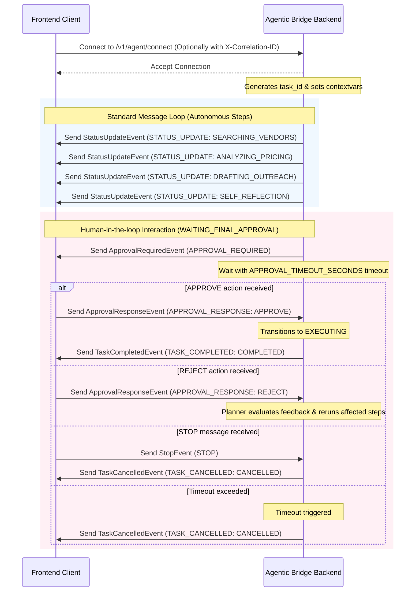

# Trybo Agentic Bridge - WebSocket Architecture

This document describes the design and contract of the real-time WebSocket communication layer between the frontend and the backend.

## Endpoint
- **URL**: `/v1/agent/connect`
- **Protocol**: WS / WSS (WebSocket)

---

## 1. Design & Communication Model

### Event-Driven Communication
The system utilizes a structured, bidirectional event-driven paradigm where:
1. **Outbound (Server-to-Client)**: The backend streams granular task states, agent logs, errors, and human-in-the-loop interactive requests.
2. **Inbound (Client-to-Server)**: The frontend sends control directives (e.g. Approve/Stop inputs) back to influence execution.

### Why WebSockets Instead of Polling?
- **Real-Time Responsiveness**: Agent execution steps (such as drafting outreach and analyzing vendor responses) need to stream instantly to the user interface.
- **Low Latency & Overhead**: Reusing a single TCP connection avoids the continuous overhead of repeatedly establishing HTTP handshakes required by polling.
- **Bi-directional Stream**: Simplifies the orchestration flow where the backend can request approval and receive a client response on the exact same channel without coordinating polling status checks.

---

## 2. Request Tracing & Correlation

To maintain clear async-safe execution traces, every connection is associated with a `correlation_id` and a `task_id`:
- During connection, the server checks the client's handshake headers for `X-Correlation-ID`.
- If missing, the server generates a new `UUID4` correlation ID.
- The server also generates a unique `UUID4` `task_id` for the session.
- These IDs are propagated using Python `contextvars` for all operations in the active WebSocket session and are automatically injected into all centralized log statements.
- Context tokens are captured upon propagation and reset in `finally` blocks in both the connection handler and background tasks to prevent context leakage across asynchronous tasks.

---

## 3. Communication Flow & State Machine





---

## 4. Orchestration & Coordination Strategies

### Active Task Registry
To coordinate async execution without databases or persistent message brokers, the backend maintains an in-memory dictionary registry `active_tasks` mapping `task_id -> task_metadata`:
```python
active_tasks[task_id] = {
    "websocket": websocket,
    "task": asyncio_task_reference,
    "approval_event": asyncio.Event(),
    "task_state": TaskState,
    "cancelled": bool
}
```
This is cleaned up immediately upon completion, cancellation, or connection drops to prevent memory leaks.

### Iterative Human-in-the-Loop Workflow
The orchestration workflow uses a simplified human-in-the-loop validation flow, pausing at `WAITING_FINAL_APPROVAL` via Python's `asyncio.Event` (`approval_event`):
- When entering `WAITING_FINAL_APPROVAL` state, the orchestrator calls `await approval_event.wait()`.
- If an `APPROVAL_RESPONSE` payload arrives, the `WorkflowState` stores the `approval_action` (and `rejection_feedback`), and `approval_event.set()` is called.
- If the action is `APPROVE`, the workflow breaks the loop and proceeds to `EXECUTING`.
- If the action is `REJECT`, the workflow evaluates feedback and reruns the affected steps, utilizing the `rejection_feedback`. A guardrail limit `MAX_REGENERATION_ATTEMPTS` prevents infinite loops.

### Approval Timeout Strategy
To prevent hanging tasks, the orchestrator wraps approval waiting in `asyncio.wait_for(...)` using a configurable timeout defined by the `APPROVAL_TIMEOUT_SECONDS` environment variable (default: `10` seconds):
- If no response is received in this window, `asyncio.TimeoutError` is raised.
- The backend catches it, logs it at `WARNING` level, transitions task state to `CANCELLED`, issues a `TaskCancelledEvent` to the client, and cleans up task resources.

### STOP Interruption Flow
If a `STOP` event is received (or a client disconnect is caught), the orchestrator triggers immediate task interruption:
- Marks the task state as `CANCELLED` and `cancelled = True`.
- Invokes `.cancel()` on the task's `asyncio.Task` reference.
- This raises `asyncio.CancelledError` inside the background runner coroutine, allowing the task to gracefully perform final event emission and connection cleanup without orphan routines.
- Checks `websocket.client_state == WebSocketState.CONNECTED` to avoid sending to a closed websocket.

---

## 5. Sample Payloads

All WebSocket event payloads derive from `BaseWebSocketEvent` containing the trace context (`event_type`, `correlation_id`, and `task_id`).

### Outbound Events (Server-to-Client)

#### Status Update
```json
{
  "event_type": "STATUS_UPDATE",
  "correlation_id": "9b1deb4d-3b7d-4bad-9bdd-2b0d7b3dcb6d",
  "task_id": "8fa16de3-d144-482d-83b9-a29bc0192d29",
  "task_state": "RUNNING",
  "agent_step": "SEARCHING_VENDORS",
  "message": "Searching for vendors..."
}
```

#### Approval Required
```json
{
  "event_type": "APPROVAL_REQUIRED",
  "correlation_id": "9b1deb4d-3b7d-4bad-9bdd-2b0d7b3dcb6d",
  "task_id": "8fa16de3-d144-482d-83b9-a29bc0192d29",
  "task_state": "WAITING_FINAL_APPROVAL",
  "draft_message": "Hello vendor, we would like to discuss pricing...",
  "message": "Draft generated. Awaiting user approval."
}
```

#### Task Completed
```json
{
  "event_type": "TASK_COMPLETED",
  "correlation_id": "9b1deb4d-3b7d-4bad-9bdd-2b0d7b3dcb6d",
  "task_id": "8fa16de3-d144-482d-83b9-a29bc0192d29",
  "task_state": "COMPLETED",
  "message": "Task successfully executed. Outreach finalized."
}
```

#### Task Cancelled
```json
{
  "event_type": "TASK_CANCELLED",
  "correlation_id": "9b1deb4d-3b7d-4bad-9bdd-2b0d7b3dcb6d",
  "task_id": "8fa16de3-d144-482d-83b9-a29bc0192d29",
  "task_state": "CANCELLED",
  "message": "Orchestration cancelled by client."
}
```

### Inbound Events (Client-to-Server)

#### Approval Response (APPROVE / REJECT)
```json
{
  "event_type": "APPROVAL_RESPONSE",
  "correlation_id": "9b1deb4d-3b7d-4bad-9bdd-2b0d7b3dcb6d",
  "task_id": "8fa16de3-d144-482d-83b9-a29bc0192d29",
  "action": "APPROVE"
}
```
*Note: For a `REJECT` action, provide the `"action": "REJECT"` and an optional `"feedback": "Make it shorter."` field to steer regeneration.*

#### Stop
```json
{
  "event_type": "STOP",
  "correlation_id": "9b1deb4d-3b7d-4bad-9bdd-2b0d7b3dcb6d",
  "task_id": "8fa16de3-d144-482d-83b9-a29bc0192d29"
}
```

---

## 6. LLM Integration Flow

The backend incorporates real-time OpenAI Chat Completion to generate and improve vendor outreach drafts dynamically within the orchestration loop.

### Steps
1. **DRAFTING_OUTREACH**: Calls `generate_outreach_draft()` targeting the OpenAI API.
   - **System Prompt**: `"You are a professional procurement assistant. Generate extremely concise vendor outreach messages."`
   - **User Prompt**: `"Generate a concise professional outreach message requesting vendor pricing discussion."`
2. **SELF_REFLECTION**: Calls `self_reflect_draft(draft)` targeting the OpenAI API.
   - **System Prompt**: `"You are reviewing an outreach message for professionalism, tone, and clarity. Keep it concise."`
   - **User Prompt**: `"Improve this outreach draft while keeping it concise and professional:\n\n{draft}"`
3. **WAITING_FINAL_APPROVAL**: Sends the refined draft message to the client via `ApprovalRequiredEvent`.

### Error Boundaries & Handling
- If OpenAI API raises an exception (e.g. invalid API key, network timeout), the orchestrator catches it, logs the error, sends a WebSocket `ErrorEvent` with `error_code="LLM_GENERATION_FAILED"`, and gracefully aborts execution.
- No retry mechanisms are implemented to maintain simple, predictable execution timing.

### Token Optimization
- Requests specify `max_tokens=150` to restrict generation length, maintain low latency, and optimize token usage.

### Configuration
- `OPENAI_API_KEY`: Fetched from the environment. Validated at startup; the server fails fast if this variable is missing or empty.
- `OPENAI_MODEL`: Configurable via the environment (defaults to `gpt-4.1-mini`).
- `OPENAI_TEMPERATURE`: Configurable parameter (defaults to `0.3`) allowing runtime tuning of LLM response creativity/determinism. Lower values ensure consistent, professional draft messages and minimize randomness in demonstration flows.

---

## 7. Lightweight Tool Architecture

Instead of adopting heavy orchestration frameworks (like LangGraph or LangChain), the orchestrator steps are refactored into isolated, modular async functions under `app/tools/`:
- **`research_tool`**: Simulates vendor discovery and returns mock structured data.
- **`analysis_tool`**: Simulates pricing and vendor analysis.
- **`draft_tool`**: Integrates OpenAI's Chat Completion to generate the initial outreach draft.
- **`reflection_tool`**: Performs self-reflection on the draft using the LLM.
- **`execution_tool`**: Executes the outreach after the approval gate is satisfied.

### Characteristics:
- **Modular Async Flow**: Every tool is written as a lightweight, independent async function that isolates its logic and handles its own execution tracing logs.
- **Configurable Delays**: Simulates latency using `await asyncio.sleep(config.AGENT_STEP_DELAY_SECONDS)`, which is controlled globally via the `AGENT_STEP_DELAY_SECONDS` environment variable (defaults to `2` seconds).
- **Tracability**: Centralized log events are triggered at the start and completion of each tool, propagating `correlation_id` and `task_id` dynamically.

---

## 8. Guardrails & Workflow Safety

### State Transition Validation
A `VALID_TRANSITIONS` map enforces which state changes are permitted. The `transition_task_state()` helper validates every transition before applying it. Invalid transitions (e.g. `COMPLETED → RUNNING`) are logged at `WARNING` level and silently rejected, preventing the workflow from entering inconsistent states.

### Terminal Event Idempotency
A `terminal_emitted` flag in the task registry ensures that terminal WebSocket events (`COMPLETED`, `FAILED`, `CANCELLED`) are emitted at most once per task lifecycle. The `send_terminal_event()` helper checks this flag before emission, preventing race-condition duplicates when cancellation and timeout fire simultaneously.

### Duplicate Task Protection
Before registering a new orchestration task, the WebSocket handler calls `is_websocket_active(websocket)` to verify that the connection does not already have a non-terminal task running. Duplicate attempts are logged at `WARNING` level and rejected without establishing a new session.

### Invalid Payload Handling
Inbound WebSocket payloads are validated for:
- Correct dictionary structure (non-dict payloads are logged and ignored).
- Known `event_type` values (`APPROVED`, `STOP`). Unknown event types are logged at `WARNING` level and safely ignored without disconnecting the client.

### LLM Output Validation
Both `generate_outreach_draft()` and `self_reflect_draft()` validate their outputs before returning:
- **Empty/whitespace-only** outputs raise a `ValueError`, which the orchestrator catches and surfaces as an `ErrorEvent` with code `LLM_GENERATION_FAILED`.
- **Defensive truncation** caps output at 2000 characters to guard against unexpectedly long responses.

---

## 9. Shared Workflow State Architecture

### Design
Inspired by graph-based orchestration systems, the backend uses a lightweight `WorkflowState` dataclass (`app/models/workflow_state.py`) as the centralized mutable runtime context shared between the orchestrator, tools, and LLM integration layers. This replaces explicit parameter chaining between tool functions.

### Fields
| Field | Type | Written By |
|---|---|---|
| `prompt` | `str` | Client (`START_TASK` event) |
| `research_data` | `dict` | `research_tool` |
| `analysis_summary` | `str` | `analysis_tool` |
| `draft` | `str` | `draft_tool` (via LLM) |
| `improved_draft` | `str` | `reflection_tool` (via LLM) |
| `execution_result` | `str` | `execution_tool` |

### Prompt-Driven Orchestration
Orchestration does **not** start on WebSocket connect. The flow is:
1. Client connects → task registered in `SCHEDULED` state.
2. Client sends `START_TASK` with `prompt` → `WorkflowState(prompt=...)` created.
3. Background orchestration task spawned → transitions `SCHEDULED → RUNNING`.
4. The user's prompt propagates through all LLM calls, making generated drafts contextually relevant.

### Why No Persistence Layer?
The workflow state is intentionally kept in-memory and scoped to a single WebSocket session lifecycle. No database, Redis, or checkpoint system is used because:
- Each task runs within one continuous WebSocket connection.
- State is cleaned up immediately on completion, cancellation, or disconnect.
- This keeps the implementation lightweight and assignment-focused.

---

## 10. Runtime In-Memory State

### `active_tasks` Registry
The `active_tasks` dictionary is the sole runtime coordination structure for all active WebSocket orchestration sessions. It maps each `task_id` to a metadata dict containing the websocket reference, asyncio task handle, approval event, task state, and workflow state.

This is **not** a persistence layer. It is an ephemeral process-local registry that exists only while the server process is running:
- Entries are created when a task is registered (`register_task`).
- Entries are removed immediately upon completion, cancellation, or disconnect (`cleanup_task`).
- No data survives a server restart — by design.

### Shared `WorkflowState`
The `WorkflowState` dataclass is the centralized mutable runtime context shared between the orchestrator, tools, and LLM services. It is graph-inspired: each tool writes to a specific field and downstream tools read from it, eliminating parameter chaining.

### Why No Database / Redis / Queue?
Repositories and external persistence are intentionally avoided because:
- **Session-scoped**: Each orchestration run lives within a single WebSocket connection. There is no need to resume across connections.
- **Short-lived**: Tasks complete in seconds, not hours. Checkpoint/restore adds complexity without value.
- **Assignment-focused**: Keeping state in-memory reduces infrastructure dependencies and keeps the system self-contained.
- **Common in practice**: Many real-time orchestration systems (including production agent runners) keep active runtime state in-memory and only persist completed results — if at all.
